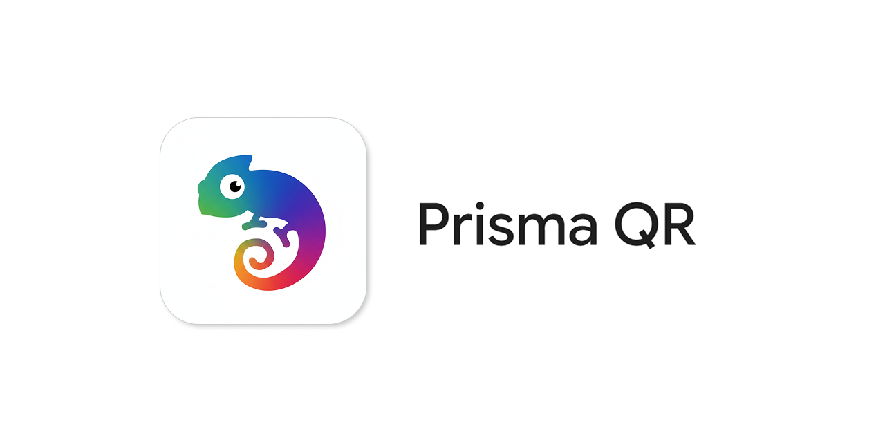

# 🌌 Prism QR — The Ultimate QR Code Companion

<p align="center">
    
</p>

- **Prism QR** is a fast, offline-first **Flutter-based mobile app** for seamlessly scanning, creating, and managing QR codes. Enjoy blazing-fast scanning with haptics, generate customizable QR codes, and save them directly to your gallery or share them with ease.

- Think of it as your all-in-one QR toolkit with instant previews and a sleek interface.


---

## ✨ Features

- 📸 **Blazing Fast Scanning** using [`mobile_scanner`](https://pub.dev/packages/mobile_scanner) to read any QR code instantly
- 🎨 **Generate QR Codes** for URLs, text, contacts, emails, and more
- 💾 **Save to Gallery & Share** — export your generated QR codes seamlessly
- 🖼️ **Scan from Image** — easily pick images from your gallery to extract QR codes
- 📳 **Haptics and Audio Feedback** for confirmed scans
- 📜 **History Log** — locally powered memory of your recent scans and creations
- ⚡ **URL Launcher** — instantly open scanned web links
- 🌗 **Dark Mode Support**
- 🛠 Built entirely with **Flutter & GetX**

---

## 📸 Screenshots

### Dark Mode
<p float="left">
    
    
    
</p>
<p float="left">
    
    
    
</p>

### Light Mode
<p float="left">
    
    
    
</p>

---

## 🧠 Use Cases

- 🔗 Instantly share Wi-Fi credentials, contact cards, or raw text privately
- 🧾 Scan payment QR codes or product details flawlessly
- 📝 Generate a highly reliable QR code for your social media profiles, portfolio, or event
- 🧰 Keep track of previous scans and creations with a built-in history ledger
- 🕵️‍♂️ Read QR codes from saved images or screenshots safely before opening them
- 🧠 Work entirely offline without depending on an internet connection for code generation

---

## 🔧 Installation

- Download the latest APK file from [here](https://github.com/jydv402/prism_qr/releases/latest)
- Install it and BOOM! You're good to go! 

---

## 📂 Project Structure

```text
lib/
├── controllers/          # GetX state management controllers
├── elements/             # Reusable sub-components and smaller UI widgets
├── models/               # Data structures
├── routes/               # App routing configuration
├── screens/              # Main UI screens (Home, Scan, Generate, Settings, etc.)
├── services/             # Core logic services (Sharing, Saving, Vibrate, Audio)
├── theme/                # Custom App Colors, TextStyles, and dark mode configuration
├── utils/                # Utility classes, helpers, and formatters
├── widgets/              # Large custom UI elements and overlays
└── main.dart             # Entry point
```

---

## 🧩 Built With

* Flutter
* Dart
* GetX
* Mobile Scanner
* QR Flutter
* Shared Preferences
* Image Gallery Saver Plus

---

## 🙏 Credits

A huge thanks to the developers of the open-source packages that made this project possible, especially:

- [mobile_scanner](https://pub.dev/packages/mobile_scanner) — For the blazing-fast barcode and QR scanning capabilities.
- [qr_flutter](https://pub.dev/packages/qr_flutter) — For the robust and customizable QR code rendering engine.
- [image_gallery_saver_plus](https://pub.dev/packages/image_gallery_saver_plus) & [share_plus](https://pub.dev/packages/share_plus) — For seamless exporting and sharing.
- [get](https://pub.dev/packages/get) — For robust state management and routing.

---

## 🤝 Contributing

Contributions are welcome and appreciated!

To get started:

1. Fork this repository
2. Create a new branch (`git checkout -b prism_qr-feature-xyz`)
3. Make your changes
4. Commit and push (`git commit -m "Added xyz"` → `git push origin prism_qr-feature-xyz`)
5. Open a Pull Request

---

## 🛡 License

This project is licensed under the **MIT License** — see the [LICENSE](LICENSE) file for details.

---

## 📣 Support & Feedback

If you find this app useful:

- 🌟 Star the repo
- 🐞 Report any issues
- 📢 Spread the word with your friends
- ❤️ Love the app and wanna share your support to keep the app going? <a href="https://buymeachai.ezee.li/jydv402" target="_blank">
  
</a>

Let’s build something beautiful, simple, and helpful together.

---

> **Built with ❤️ by [JD](https://github.com/jydv402)** — striving to create tools that make life a little simpler.
